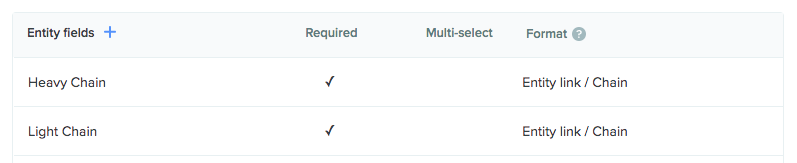
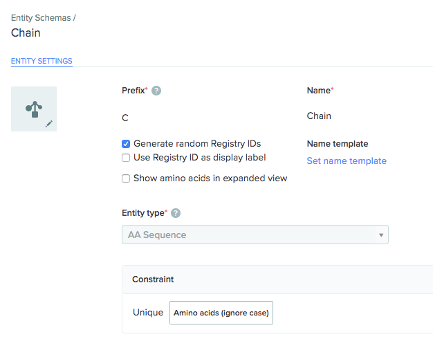
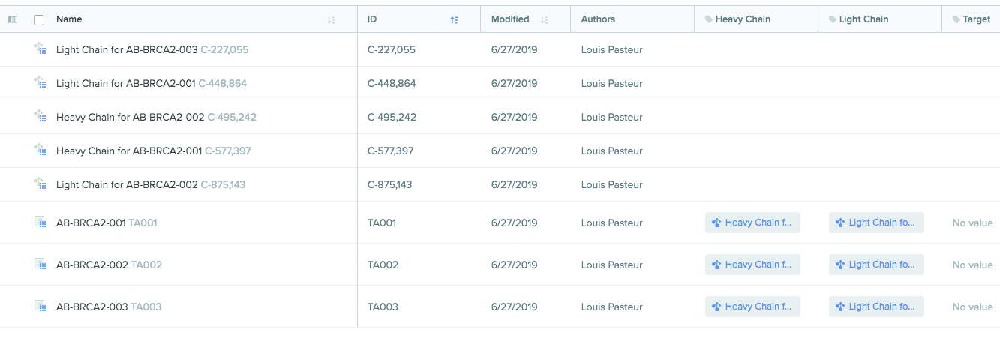

This script demonstrates how to import and register entities. In this example, we are importing antibodies defined in a JSON file:

- Each Antibody entity links to a Heavy Chain and a Light Chain entity
- The Heavy Chain and Light Chain are amino acid (AA) sequences

The antibodies to import are provided in the following format:

```
{
  "name": "AB-BRCA2-001",
  "Heavy Chain": "AAAAAAAAAAAAAAAAAAAAAAAA",
  "Light Chain": "CCCCCCCCCCCCCCCCCCCCCCCC"
}
```

# Prerequisites

This script requires the Registry and Molecular Biology applications. In addition, the script expects two **entity schemas** to be configured ([instructions](https://help.benchling.com/articles/2725066-configure-your-registry)).

- An Antibody schema with Heavy Chain and Light Chain fields: 
- A Chain schema with the AA Sequence entity type and a unique constraint on the amino acid sequence: 

Finally, you need the ID of a folder to import into. You can find or [create](https://help.benchling.com/articles/2724910-create-folders-to-organize-data-within-projects) a folder, and then use the API to [list all folders](https://docs.benchling.com/v2/reference#list-folders) and find the ID of your folder.

# How to run the script

- First, ask Benchling support to enable API access on your account, and create API credentials. Instructions: https://help.benchling.com/articles/2353570-access-the-benchling-api-enterprise
- Install Python 3 and [Pipenv](https://docs.pipenv.org/en/latest/)
- Install dependencies using `pipenv install`
- Run `pipenv shell` to work in a virtualenv that includes the dependencies.
- Run the script. For example (replace the folder/registry/schema IDs with your own):

```
python sync_into_benchling.py \
  --domain example.benchling.com \
  --api-key $YOUR_API_KEY
  --folder-id lib_9NmU9eFB \
  --registry-id src_Lmysq16b \
  --antibody-schema-id ts_LpAfe6xV \
  --chain-schema-id ts_M9ft0HsP \
  antibodies.json
```

If successful, the script will print the Registry IDs of the new Antibody and Chain entities:

```
Registered new Antibody TA001 with Heavy Chain C-577,397 and Light Chain C-448,864
Registered new Antibody TA002 with Heavy Chain C-495,242 and Light Chain C-875,143
Registered new Antibody TA003 with Heavy Chain C-495,242 and Light Chain C-227,055
```

## How to view the imported entities

To view the imported entities, open the folder that they were imported into: 
