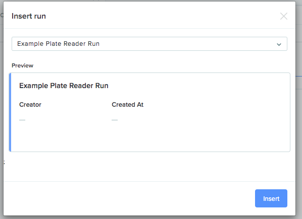

This script demonstrates how to upload results in to Benchling from a CSV file. In this example, the CSV contains some fluorescence measurements from a plate reader. Here are the first few rows:

| Sample | Well | Signal | Mean | CV          | Calc. Concentration | Calc. Conc. Mean | Calc. Conc. CV |
| ------ | ---- | ------ | ---- | ----------- | ------------------- | ---------------- | -------------- |
| U001   | A05  | 4195   | 4428 | 7.44154833  | 335.5175194         | 349.9100519      | 5.816956229    |
| U001   | B05  | 4661   | 4428 | 7.44154833  | 364.3025843         | 349.9100519      | 5.816956229    |
| U002   | C05  | 6151   | 6153 | 0.034478998 | 452.6729507         | 452.7595571      | 0.027051867    |

# Prerequisites

This script requires the Results module. To define the type of data to upload, you must configure a **result schema** before running the script. In addition, to group the uploaded results together, you need to configure a **run schema**. Here's now:

- First, [configure the run schema](https://help.benchling.com/results-enterprise/configuration/configure-a-run-schema). You can leave the fields empty (`"fields": []`)
- The run schema page should have a URL like https://example.benchling.com/your_username/assay-schemas/runs/assaysch_i2sX8NGy. Copy the last part of the URL, e.g. `assaysch_i2sX8NGy`, and write it down as the **run schema ID**. You'll need this to configure the result schema and run the script.
- Then, configure the result schema and copy the result schema ID from URL. Follow the instructions [here](https://help.benchling.com/results-enterprise/configuration/configure-a-result-table) and use the following fields, making sure to replace `YOUR_RUN_SCHEMA_ID_HERE` at the bottom with your own schema ID:

```
{
    "fields": [
        {
            "isMulti": false,
            "type": "text",
            "displayName": "Sample",
            "name": "sample",
            "isRequired": true
        },
        {
            "isMulti": false,
            "type": "text",
            "displayName": "Well",
            "name": "well",
            "isRequired": true
        },
        {
            "isMulti": false,
            "type": "float",
            "displayName": "Signal",
            "name": "signal",
            "isRequired": true
        },
        {
            "isMulti": false,
            "type": "float",
            "displayName": "Mean",
            "name": "mean",
            "isRequired": true
        },
        {
            "isMulti": false,
            "type": "float",
            "displayName": "CV",
            "name": "cv",
            "isRequired": true
        },
        {
            "isMulti": false,
            "type": "float",
            "displayName": "Calc. Concentration",
            "name": "calc_concentration",
            "isRequired": true
        },
        {
            "isMulti": false,
            "type": "float",
            "displayName": "Calc. Conc. Mean",
            "name": "calc_conc_mean",
            "isRequired": true
        },
        {
            "isMulti": false,
            "type": "float",
            "displayName": "Calc. Conc. CV",
            "name": "calc_conc_cv",
            "isRequired": true
        },
        {
            "isMulti": false,
            "isRequired": false,
            "schemaId": "YOUR_RUN_SCHEMA_ID_HERE",
            "type": "assay_run_link",
            "name": "run"
        }
    ]
}
```

# How to run the script

- Ask Benchling support to enable API access on your account
- Click on the icon at the bottom left corner of the screen:


- Go to the bottom of the page and generate an API key. You should see the API key on the screen:


- Install Python 3 and [Pipenv](https://docs.pipenv.org/en/latest/)
- Install dependencies using `pipenv install`
- Run `pipenv shell` to work in a virtualenv that includes the dependencies.
- Run the script. For example (replace the schema IDs with your own):

```
python upload.py --domain example.benchling.com --api-key $YOUR_API_KEY --run-schema-id assaysch_i2sX8NGy --result-schema-id assaysch_17odsh8E
```

- The script should print the IDs of the uploaded results:

```
{'assayResults': ['275f8882-3864-461e-b3e1-0c10cad9f7a0', '0fd246db-3522-424d-b959-a9f4d5b18c8f', '2899ab99-fe95-4ca4-bedc-9c256b2118d4', '2a63a15c-95f8-4959-a174-90c0764a193f', 'd6de42ef-8355-4231-80b5-e11f59ca8d93', 'fde94c44-523b-4981-a90d-79cba230962f', '57fe160b-8243-4903-80bf-23884af05c09', '189d2746-8a61-42ca-bb6d-25272586dc14', '891e6054-3ec8-4527-b4d8-983752692294', '397a9657-e4e9-4078-aee8-e2ce08c1d193', '6129454d-d5e5-45fa-8027-5bdca57dc539', 'f31ea3aa-6e7e-47ea-870a-41fc98e7c36a', '272cb2d6-94e1-41e6-9202-20595c6a0264', 'a4557a87-14a1-458b-b329-5a9f062e4ad2', 'ee6572a1-ca94-4790-b130-b6e13d016b15', '2e8f49bd-29c2-42bd-bef7-3e1411bfbadf', '7f80973b-3ff6-484c-94ab-877ea6021ffa', '15728c0b-22e2-427a-9999-98dc6546685b', 'f807db65-c6da-4594-a1e2-ba83ea7e510a', 'cbf7c9f6-ccb8-4aff-84f1-e9b5c34ad053', '0bfa335a-096b-4efb-a72b-ff47bff74c8f', '8a484c3b-9b2d-4b33-8d8b-c3909f5c816e', 'fdc7ecab-e800-4262-8cca-a18ae4a0a903', '213daac9-9c8f-4d59-8c8e-f63927ca9d7f'], 'errors': None}
```

# How to view the results

After running the script, the results can be viewed in any Notebook entry.

- Open the Insert menu and select the option for `Result table`


- Insert an `Example Plate Reader Run`



- Choose `Insert from inbox`


- Insert the most recent run
- The results you uploaded should show up:


